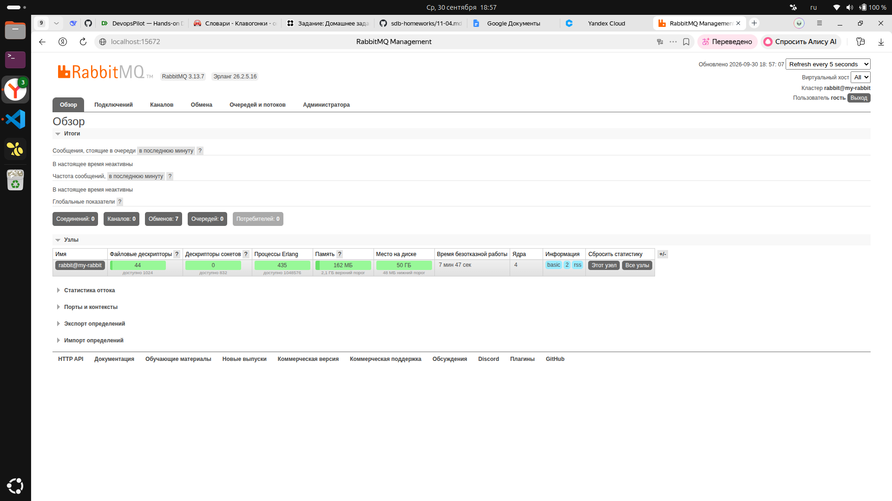
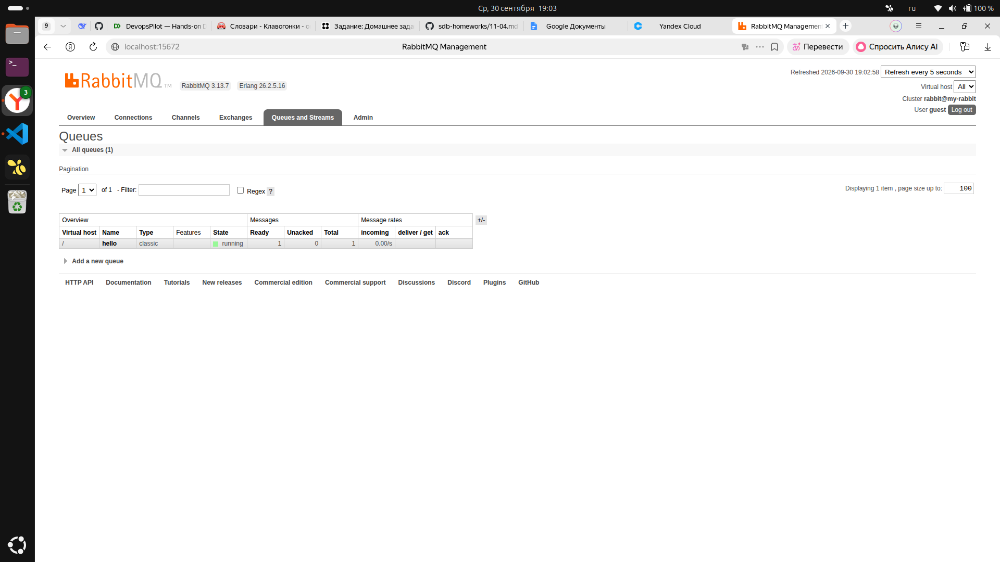
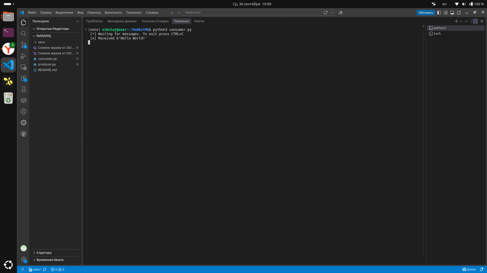
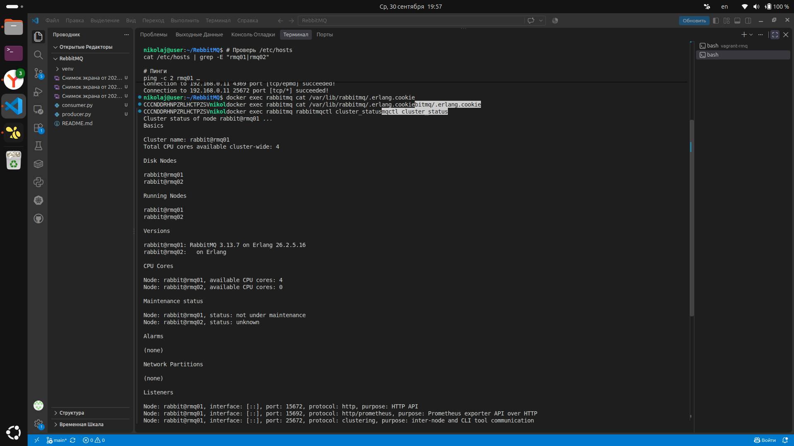
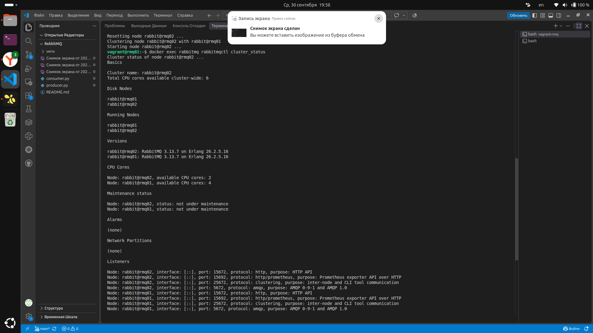
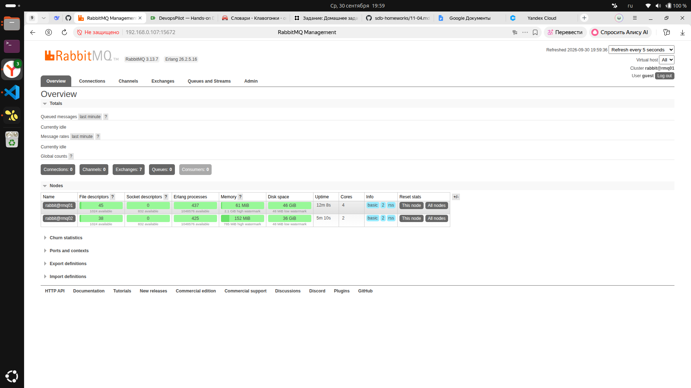
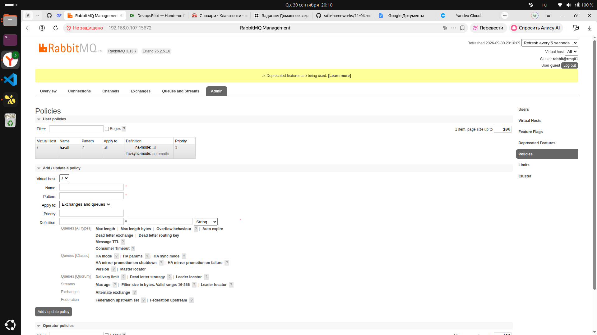
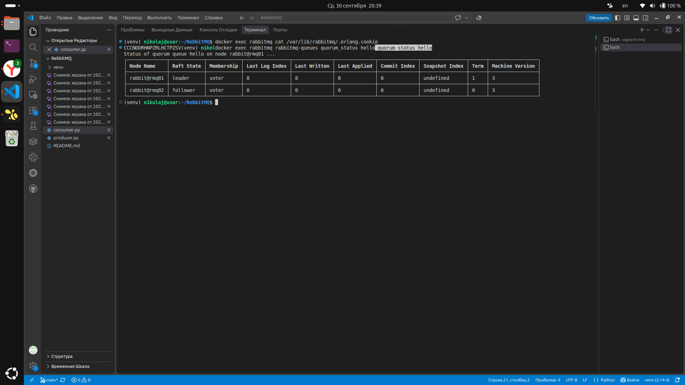
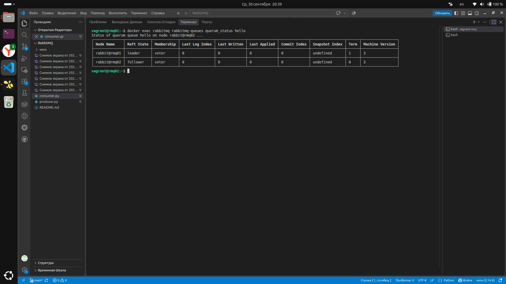
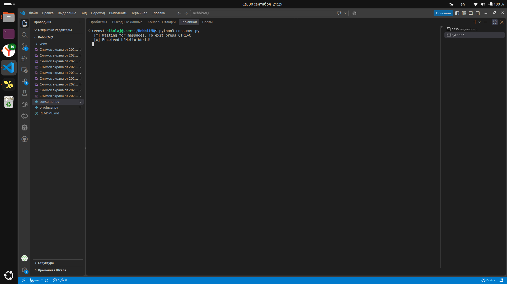

# Домашнее задание по RabbitMQc

Выполнил Николай Галицин: установил RabbitMQ в Docker, поработал с очередями через Python и собрал HA-кластер из двух нод.

---

## Задание 1. Установка RabbitMQ

Поднял RabbitMQ через Docker на Ubuntu. Использовал образ `rabbitmq:3-management` — в нём уже есть веб-интерфейс.

```bash
docker run -d \
  --hostname my-rabbit \
  --name rabbitmq \
  -p 5672:5672 \
  -p 15672:15672 \
  rabbitmq:3-management
```

Была проблема: Docker не мог скачать образ с Docker Hub (прерывалось соединение). Решил проблему с помощью зеркала:

```bash
sudo tee /etc/docker/daemon.json > /dev/null <<'EOF'
{ "registry-mirrors": ["https://mirror.gcr.io"] }
EOF
sudo systemctl restart docker
```

Зашёл в веб-интерфейс по адресу `http://192.168.0.107:15672`, логин `guest` / пароль `guest`.



---

## Задание 2. Отправка и получение сообщений

Поставил Python 3 и библиотеку Pika в виртуальное окружение:

```bash
cd ~/RebbitMQ
python3 -m venv venv
source venv/bin/activate
pip install pika
```

**producer.py** — отправляет сообщение:

```python
import pika

connection = pika.BlockingConnection(
    pika.ConnectionParameters(host='192.168.0.107')
)
channel = connection.channel()
channel.queue_declare(queue='hello')

channel.basic_publish(
    exchange='',
    routing_key='hello',
    body='Hello World!'
)
print(" [x] Sent 'Hello World!'")
connection.close()
```

**consumer.py** — получает сообщение:

```python
import pika

connection = pika.BlockingConnection(
    pika.ConnectionParameters(host='192.168.0.107')
)
channel = connection.channel()
channel.queue_declare(queue='hello')

def callback(ch, method, properties, body):
    print(f" [x] Received {body}")

channel.basic_consume(
    queue='hello',
    on_message_callback=callback,
    auto_ack=True
)

print(' [*] Waiting for messages. To exit press CTRL+C')
channel.start_consuming()
```

Запустил producer — сообщение ушло в очередь. Проверил в веб-интерфейсе — очередь `hello` появилась с `Ready: 1`.



Потом запустил consumer — он получил сообщение.



---

## Задание 3. HA-кластер

Создал вторую виртуальную машину через Vagrant (`rmq02`), объединил её с хостом (`rmq01`) в кластер и настроил репликацию очередей.

**Архитектура:**

```
Хост (rmq01, 192.168.0.107)  <-->  Vagrant VM (rmq02, 192.168.0.11)
RabbitMQ в Docker                  RabbitMQ в Docker
```

**Vagrantfile:**

```ruby
Vagrant.configure("2") do |config|
  config.vm.define "rmq02" do |node|
    node.vm.box = "ubuntu/jammy64"
    node.vm.hostname = "rmq02"
    node.vm.network "public_network", ip: "192.168.0.11"
    node.vm.provider "virtualbox" do |vb|
      vb.memory = 2048
      vb.cpus = 2
    end
  end
end
```

### Проблемы и решения

1. **Vagrant не устанавливался из официального репозитория** — Ubuntu 26.04 ещё не поддерживается. Скачал zip-бинарник с сайта HashiCorp.
2. **`/etc/hosts`** прописал на обеих машинах:

```
192.168.0.107 rmq01
192.168.0.11  rmq02
```

3. **Erlang cookie** — общий секрет для кластеризации. Скопировал с хоста в ВМ.
4. **Порты 4369 и 25672** пробросил у обоих контейнеров.

### Сборка кластера

На `rmq02` выполнил:

```bash
docker exec rabbitmq rabbitmqctl stop_app
docker exec rabbitmq rabbitmqctl reset
docker exec rabbitmq rabbitmqctl join_cluster rabbit@rmq01
docker exec rabbitmq rabbitmqctl start_app
```





### Политика ha-all

В веб-интерфейсе создал политику:

| Поле | Значение |
|---|---|
| Name | `ha-all` |
| Pattern | `.*` |
| Apply to | `Exchanges and queues` |
| Priority | `1` |
| Definition | `ha-mode: all`, `ha-sync-mode: automatic` |



### Проверка репликации

Отправил сообщение и проверил очередь на обеих нодах:





Очередь `hello` в веб-интерфейсе — тип `classic`, feature `D ha-all`, нода `rabbit@rmq01 +1`:



### Проверка отказоустойчивости

Остановил `rmq01`, изменил в `consumer.py` host на `192.168.0.11` (rmq02) и запустил его. Consumer получил сообщение со второй ноды:



После теста вернул `rmq01` обратно: `docker start rabbitmq`.

---

## Выводы

- RabbitMQ в Docker поднимается легко, но нужен рабочий доступ к Docker Hub — помогло зеркало.
- Pika ставится только в venv (PEP 668).
- Для кластера критичны: одинаковый Erlang cookie, проброшенные порты 4369/25672 и правильные записи в `/etc/hosts`.
- Политика `ha-all` применяется только к очередям, созданным **после** её добавления.
- При падении одной ноды consumer получает сообщение со второй — кластер работает.

Для продакшена 2 ноды мало: при падении одной quorum-очереди теряют кворум. Лучше 3+ ноды или quorum-очереди. Но для учебного задания classic + `ha-all` работает.

---
